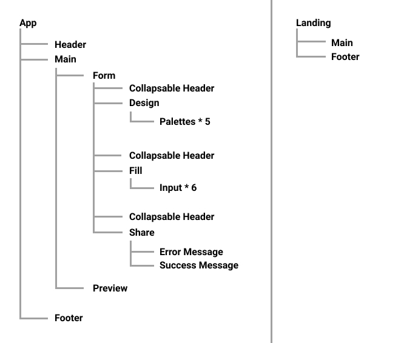

# Proyecto módulo 3 - Team 7

En este proyecto vamos a utilizar _React_ para refactorizar una web interactiva hecha con Vanilla JavaScript.

Proyecto original: [Undefined](http://beta.adalab.es/project-promo-m-module-2-team-5/).

## Directory Structure

```
src
 ├─ components
 |  ├─ App.js
 |  ├─ CollapsableHeader.js
 |  ├─ Design.js
 |  ├─ ErrorMessage.js
 |  ├─ Fill.js
 |  ├─ Footer.js
 |  ├─ Form.js
 |  ├─ Header.js
 |  ├─ Input.js
 |  ├─ Landing.js
 |  ├─ Main.js
 |  ├─ Palettes.js
 |  ├─ Preview.js
 |  ├─ Share.js
 |  └─ SuccessMessage.js
 |
 ├─ images
 |  ├─ logo-adalab.png
 |  ├─ logo-u.png
 |  ├─ preview.png
 |  └─ preview2.png
 |
 ├─ stylesheets
 |  ├─ core
 |  ├─ layout
 |  ├─ pages
 |  └─ App.scss
 |
 └─ index.js
```

## Components Architecture



## Run project

In the project directory, you can run:

### `npm install`

### `npm run dev`

Runs the app in the development mode.\
Open [http://localhost:4000](http://localhost:4000) to view it in the browser.
